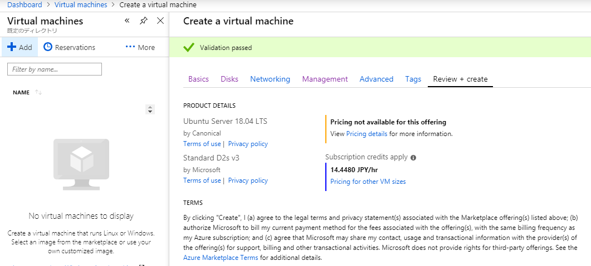
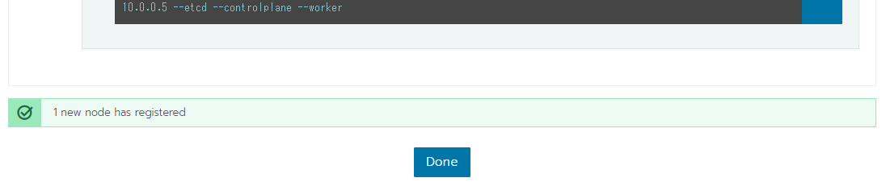
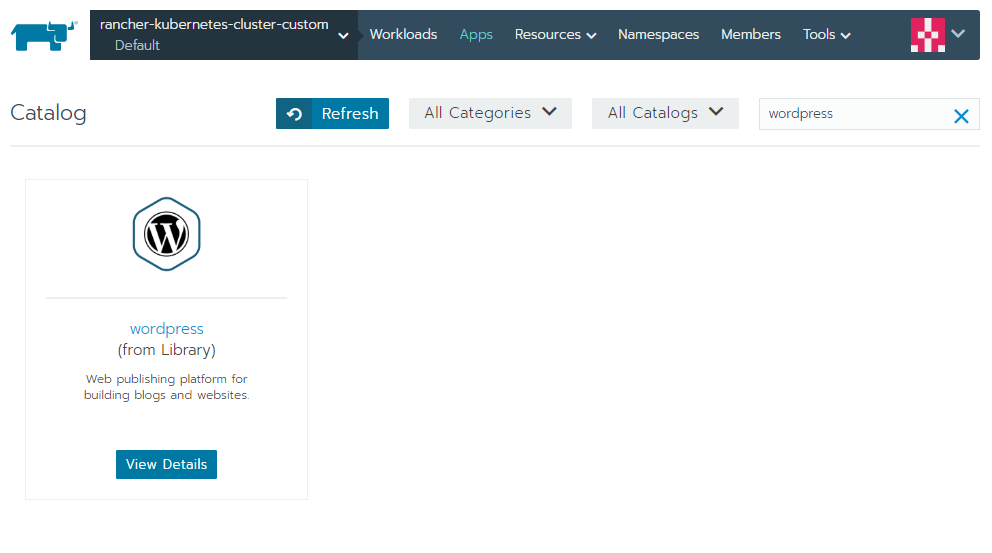

name: inverse
layout: true
class: center, middle, inverse-red

---
## Multi-Cluster Management with Rancher

---
exclude: true
layout: false
### whoami

.left-small[
  
]

.right-large[
- Kyohei Mizumoto(@kyohmizu)

- C# Software Engineer

- Interests
  - Docker/Kubernetes
  - Go
  - Security
]

---
layout: false
### Target

- People who:

  - haven't used Rancher

  - are interested in multi-cluster management

---
### Preferred

- The basic knowledge of:

  - Docker

  - Kubernetes

  - Cloud platform(e.g. AKS, GKE)

---
### Agenda

- What is Rancher?

- Get Started on Azure

- Manage Clusters

  - Add Clusters

  - Deploy Wordpress from Catalog

---
class: center, middle, inverse-red
## What is Rancher?

---
class: header-margin
### Docker

.left-large[
- Container packaging and runtime standard

- Build container images from Dockerfiles

- Distribute container images from Docker registries
]

.right-small[<center></center>
]

---
class: header-margin
### Kubernetes

.left-large[
- Container cluster management standard

- Open source software

- Cloud Native Computing Foundation(CNCF) hosts
]


.right-small[<center></center>
]

---
class: header-margin
### Rancher

.left-large[
- Container management platform

- Open source software

- Deliver Kubernetes as a Service(KaaS)

- Paid support
]

.right-small[<center></center>
]

---
### Features

- GUI based management

  - Add clusters

  - Deploy resources using catalogs

- Easy to start

  - No need to have in-depth knowledge of Kubernetes

---
### Run Kubernetes Everywhere

- Create Kubernetes clusters with:

  - Rancher Kubernetes Engine (RKE)

  - Cloud Kubernetes services(e.g. GKE, AKS, EKS)

-  Import & manage existing Kubernetes clusters

---
### Empower DevOps Teams

- Each team deploys their applications on the public/ private clouds they choose

<center></center>

---
### Architecture

<center></center>

---
### Architecture

- Rancher API Server

- Cluster Controller and Agents

- Authentication Proxy

---
class: center, middle, inverse-red
## Get Started on Azure

---
### Installation

- Single Node Install

  - Install by running a single Docker container

  - For development and testing environments

- High Availability (HA) Install

  - Install in a Kubernetes cluster

  - For production environments

---
### Installation

- Single Node Install

  - Install by running a single Docker container

  - For development and testing environments

.color-gray[
- High Availability (HA) Install

  - Install in a Kubernetes cluster

  - For production environments
]

---
class: header-margin
### Create VM on Azure

<center></center>

---
### Install

- ssh to the VM

- Install Docker with the following command:

.zoom1[
```bash
$ curl https://releases.rancher.com/install-docker/18.09.sh | sh
```
]

- Install Rancher with the following command:

.zoom1[
```bash
$ sudo docker run -d --restart=unless-stopped -p 80:80 \
  -p 443:443 rancher/rancher:v2.2.2
```
]

---
### Access to VM

```yaml
https://[IP address of VM]
```

<center></center>

---
### Settings

- Set a password

- Save the URL(default)

---
class: header-margin
### Done :)

<center></center>

---
class: center, middle, inverse-red
## Manage Clusters

---
## Sample

- Add Clusters

  - Custom

  - AKS

- Deploy Wordpress from Catalog

---
class: center, middle, red
## Create Custom Cluster

---
### Advance Preparation

- Create an another VM for node on Azure

```yaml
name: rancher-node
image: Ubuntu Server 18.04 LTS
OS-disk-type: Standard SSD
auto-shutdown: off

```

- Add inbound port rules

  - 22, 443

---
class: header-margin
### Select Custom

<center></center>

---
### Set IPs of VM

<center></center>

---
### Create a Cluster

- Run the copied command on VM

.zoom0[
```bash
$ sudo docker run -d --privileged --restart=unless-stopped --net=host \
  -v /etc/kubernetes:/etc/kubernetes -v /var/run:/var/run rancher/rancher-agent:v2.2.2 \
  --server https://xx.xx.xxx.xx --token 666ltr6qntjz2xxxxxxxxxxxxxxxxxxxxxxxxxxxxxx \
  --ca-checksum f707d53266d14e03ff3452896dxxxxxxxxxxxxxxxxxxxxxxxxxxx --address xx.xx.xxx.xx \
  --internal-address 10.x.x.x --etcd --controlplane --worker
```

<br/>
]

<center></center>

---
class: header-margin
### Provisioning...

<center></center>

---
class: header-margin
### Done :)

<center></center>

---
class: header-margin
### View Resources

<center></center>

---
class: center, middle, red
## Create AKS Cluster

---
### Advance Preparation(on Azure)

- Create a new resource group for AKS

```yaml
rancher-aks-sample
```

- Create a service principal

.zoom1[
```bash
$ az ad sp create-for-rbac --skip-assignment -n sp-aks-sample
appId: 03f94503-xxxx-xxxx-xxxx-xxxxxxxxxxxx
displayName: sp-aks-sample
name: http://sp-aks-sample
password: xxxxxxxx-xxxx-xxxx-xxxx-xxxxxxxxxxxx
tenant: 2bdec7af-xxxx-xxxx-xxxx-xxxxxxxxxxxx

$ az role assignment create --assignee 03f94503-xxxx-xxxx-xxxx-xxxxxxxxxxxx \
  --role Contributor --resource-group rancher-aks-sample

```
]

---
### Advance Preparation(on Azure)

-  Register resource providers

.zoom2[
```bash
$ az provider register -n Microsoft.OperationalInsights

$ az provider register -n Microsoft.OperationsManagement
```
]

<u><https://docs.microsoft.com/en-us/azure/azure-resource-manager/resource-manager-register-provider-errors></u>

---
class: header-margin
### Select AKS

<center></center>

---
### Set Credentials

- Client ID is appId

- Client secret is the password value

<center></center>

---
class: header-margin
### Done :)

<center></center>

---
class: center, middle, red
## But...

---
class: header-margin
### Unsolved Problem

<center></center>

---
### Issue

- AKS

<u><https://github.com/Azure/AKS/issues/173></u>

- Rancher

<u><https://github.com/rancher/rancher/issues/11496></u>

---
class: center, middle, red
### Deploy Wordpress from Catalog

---
class: header-margin
### Deploy on Custom Cluster

<center></center>

---
class: header-margin
### Select Wordpress

<center></center>

---
### Settings

- Set Password, and change others if necessary

<center></center>

---
class: header-margin
### Done :)

<center></center>

- Endpoint is created

.zoom1[
```yaml
http://xip.io-wordpress.wordpress.00.000.000.000.xip.io
```
]

---
class: header-margin
### Access to Endpoint

<center></center>

---
### Deploy on AKS Cluster

---
### Links

.zoom1[
マルチクラウド時代の最強コンビ　RancherによるKubernetes活用ガイド  
<u><https://thinkit.co.jp/series/8740></u>

Official - Rancher 2.x  
<u><https://rancher.com/docs/rancher/v2.x/en/></u>

]

---
class: center, middle, red
## Thank you!
